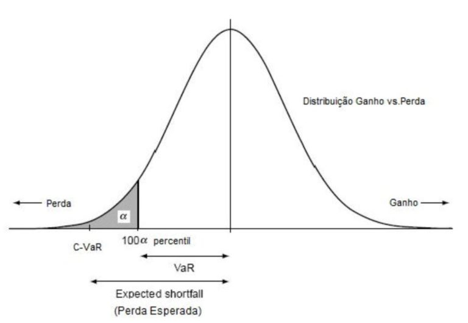
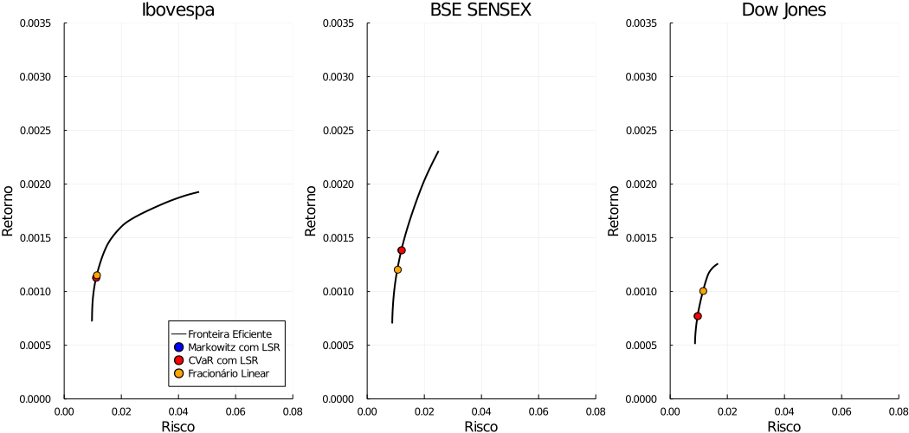
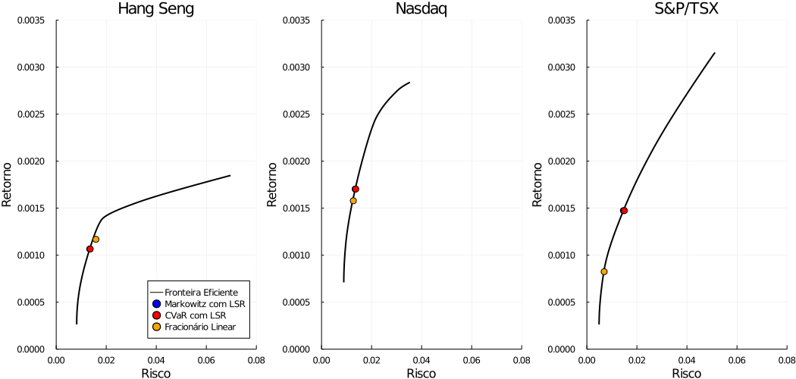
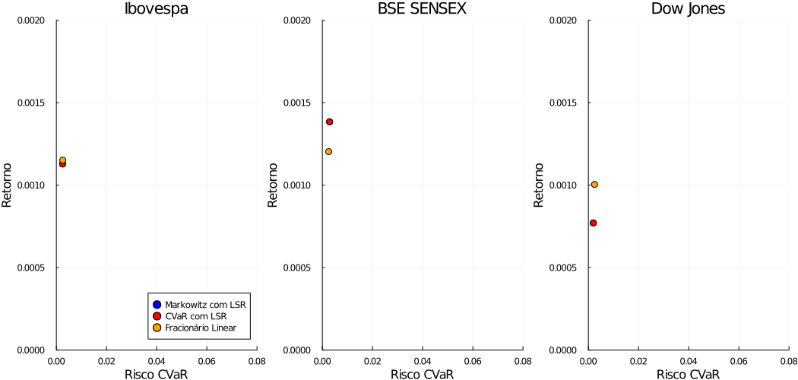
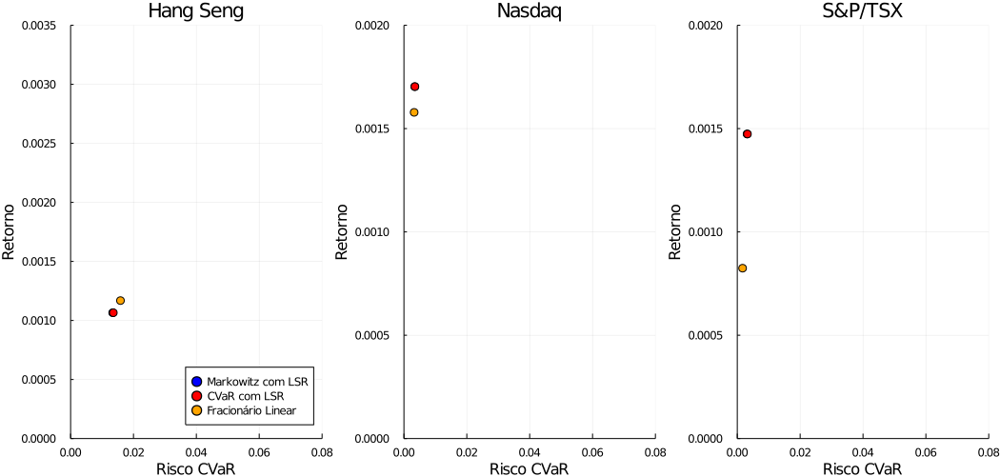
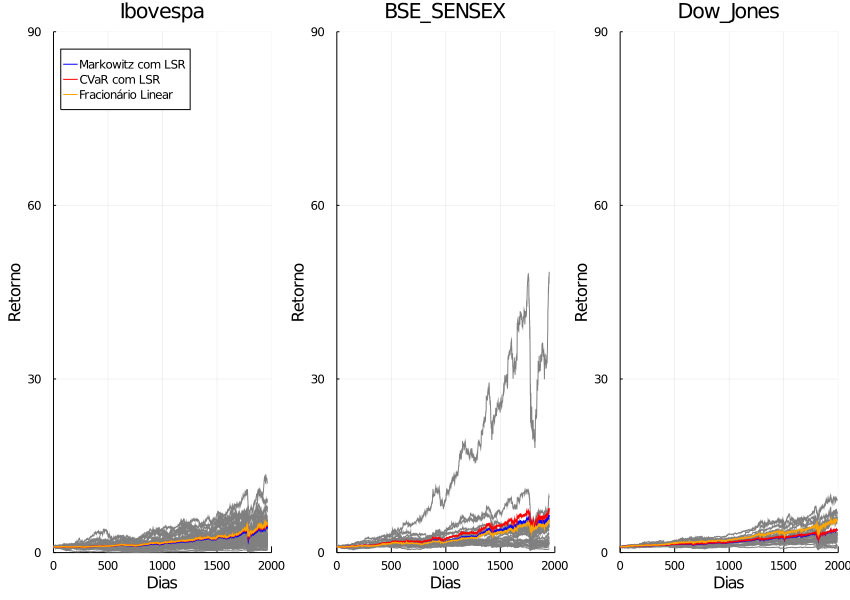
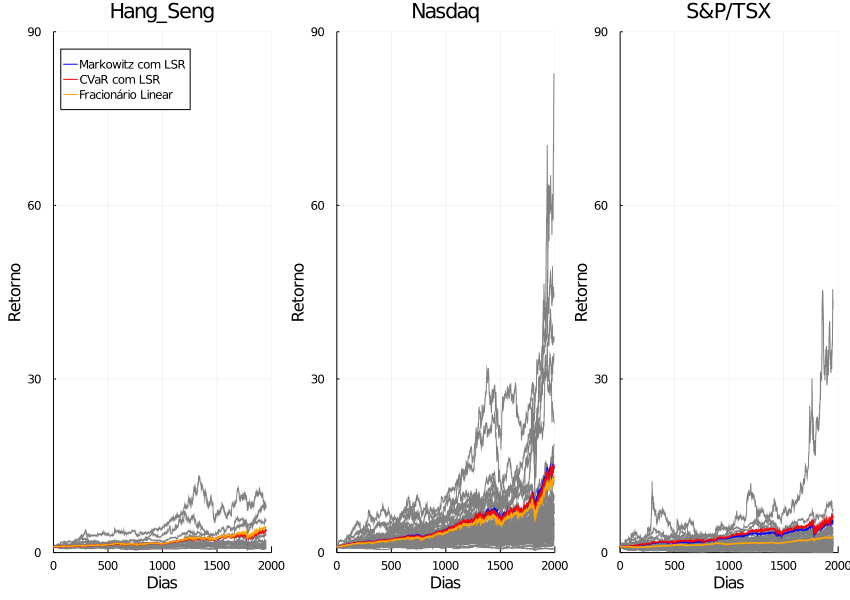

## **Introdução**
O problema de otimização de carteiras consiste na escolha dos melhores investimentos em um conjunto de ativos possíveis. Os investidores buscam uma carteira que gera o menor risco e maior retorno, porém isso nem sempre é possível. Desta forma, na prática se procura equilibrar o retorno monetário e o risco de perdas.

Ao considerar ativos e carteiras num horizonte de tempo, o investidor deve levar em consideração que nesse processo existem vários riscos do mercado, de crédito e de operações. Desta forma, a diversificação dos ativos escolhidos é necessária para que o risco seja diminuído, possibilitando o aumento do retorno obtido na carteira de ativos.

Neste projeto consideramos o modelo fracionário, ou racional, e sua linearização apresentadas por Brar et al. [3], para fazer a otimização de carteira de ações ou ativos. Este modelo fracionário otimiza o retorno da carteira minimizando o risco da mesma, simultaneamente. Para a análise dos modelos, utilizamos ativos de várias bolsas de valores, comparando os resultados por bolsa de valores ou modelos. Anteriormente ao uso do modelo fracionário, comparamos os ativos das bolsas de valores usando o modelo de Markowitz e o modelo CVaR. Além disso, consideramos o modelo Markowitz Multi-Objetivo para fazer a fronteira eficiente e respectiva análise.

## **Base de Dados**
Os dados compreendem sete base de dados de diferentes bolsa de valores com seus respectivos ativos, considerando o período de 02.jan.2013 à 27.nov.2020. Os datasets são:
* Ibovespa - Brasil - 63 ações e 1963 dias;
* BSE SENSEX - Bombaim, Índia - 27 ações e 1948 dias;
* Dow Jones - New York, Estados Unidos - 29 ações e 1992 dias;
* Hang Seng Index - Hong Kong, China - 25 ações e 1950 dias;
* Nasdaq - New York, Estados Unidos - 93 ações e 1992 dias;
* S&P/TSX Composite - Toronto, Canadá - 87 ações e 1953 dias.

Os dados das bases, em csv, foram obtidos através de Web Scraping, do site do Yahoo Finance [11], usando o pacote yfinance da linguagem de programação Python [9]. Nas bases de dados somente foi considerado os ativos que possuem dados em todos os dias em que houve pregão na cidade específica da bolsa de valores em questão. Por isso, a quantidade de ações que compõem as bolsas é diferente.

As análises e implementações dos modelos de otimização de ações foram realizadas na linguagem de programação Julia [2]. O pacote com as funções implementadas e testes podem ser obtidos em [github.com/CiDAMO/PortfolioOptimization.jl](https://github.com/CiDAMO/PortfolioOptimization.jl) e os códigos do script em [github.com/fillipepierin/IC-Otimizacao-de-Carteiras-de-Acoes](https://github.com/fillipepierin/IC-Otimizacao-de-Carteiras-de-Acoes).

## **Metodologia - Modelos**

Os modelos considerados e utilizados foram o modelo de Markowitz, o modelo de Markowitz Multi-Objetivo, modelo CVaR e modelo Fracionário.

**Modelo de Markowitz**

O modelo de Markowitz (MW), também conhecido por modelo de média-variância foi um modelo construído por Markowitz em 1952 [7], em que se procuram as combinações de ativos, utilizando dados históricos de retorno. Este modelo é chamado de média-variância, pois utiliza a média e o desvio padrão dos retornos dos ativos, denominado por Markowitz por retorno e risco no modelo, para encontrar o peso de cada ativo, $x_{i}, i \in {1, \dots, n}$ que compõe a carteira. O retorno e risco são dados por $\mu^{T} x$ e $x^{T} \sigma x$, respectivamente. Os investidores tentam encontrar os pesos dos ativos, por modelos matemáticos, de forma a maximizar o retorno e ou minimizar o risco. O modelo de Markowitz é dado por um problema de otimização da seguinte forma

$$
{\displaystyle {\begin{aligned}&{\underset {x}{\operatorname {minimizar} }}&&x^T \sigma x\\
    &\operatorname {sujeito\;a} &&\sum_{i} x_{i} = 1, i = 1, \dots, n,\\
    &&&x \geq 0,\end{aligned}}}
$$
onde $\sigma$ é a matriz de covariância entre os ativos da carteira de ações em questão.

Além disso, podemos acrescentar restrições no modelo MW para considerar um risco mínimo ou um retorno máximo, onde teremos os modelos MW com limite superior de risco (LSR) e MW com limite inferior de retorno esperado (LIRE). O modelo MW com LSR é o modelo de Markowitz apresentado anteriormente, adicionando a restrição
$$
\mu^{T} x \geq \mu_{min} + \lambda * (\mu_{max} - \mu_{min}),
$$
em que $\mu_{min}$ e $\mu_{max}$ são o menor e o maior valores de retorno (média) entre as ações da carteira. Já o modelo MW de máximo com LIRE é o modelo de Markowitz anterior acrescentando a restrição

$$
x^{T} σ x ≤ σ_{max} + λ * (σ_{max} - σ_{min})),
$$
em que $σ_{max}$ e $σ_{min}$ são o menor e o maior valores da covariância entre os ativos da carteira.

**Modelo Markowitz Multi-Objetivo**

No modelo Markowitz Multi-Objetivo, a função objetivo é a combinação dos objetivos dos modelos de Markowitz, em que o primeiro leva em consideração a restrição de limite inferior para o retorno e o segundo a restrição de limite superior para o risco. Este modelo de otimização tem a seguinte forma:
$$
\displaystyle {\begin{aligned}&{\underset {x}{\operatorname {minimizar} }}&&-\mu^{T} x + \lambda x^T \sigma x\\
    &\operatorname {sujeito\;a} &&\sum_{i} x_{i} = 1, i = 1, \dots, n,\\
    &&&x \geq 0.\end{aligned}}
$$

O script da modelagem na programação Julia, que engloba os modelos Markowitz, Markowitz com limite superior de risco (mínimo de risco), Markowitz com limite inferior de retorno esperado (máximo de retorno) e Markowitz Multi-Objetivo (mixed), é apresentado a seguir. Neste script também se usa os otimizadores Ipopt e Cbc.

<!-- ```julia
function markowitz(μ, σ, λ)
    n = length(μ)
    μmin, μmax = extrema(μ)
    σmin, σmax = extrema(σ)
    
    model = Model(optimizer_with_attributes(Ipopt.Optimizer, "print_level" => 0))
    @variable(model, 0 ≤ x[1:n] ≤ 1)
    @objective(model, Min, dot(x, σ, x))
    @constraint(model, dot(μ, x) ≥ μmin + λ * (μmax - μmin)) % usar essa restrição se MW com LSR
    @constraint(model, dot(x, σ, x) ≤ σmax + λ * (σmax - σmin)) % usar essa restrição se MW com LIRE
    @constraint(model, sum(x) == 1)
    optimize!(model)
    
    return value.(x)
end
```` -->

<!-- ```julia
function markowitz_multi_objetivo(μ, σ; λ = 4.0)
    n = length(μ)
    
    model = Model(optimizer_with_attributes(Ipopt.Optimizer, "print_level" => 0))
    @variable(model, 0 ≤ x[1:n] ≤ 1)
    @objective(model, Min, - dot(μ, x) + λ * dot(x, σ, x))
    @constraint(model, sum(x) == 1)
    optimize!(model)
    
    return value.(x)
end
```` -->

```julia
export markowitz, markowitz_min_risk, markowitz_max_returns, markowitz_mixed
markowitz_min_risk(μ::AbstractArray, σ::AbstractMatrix; kwargs...) = markowitz(:min_risk, μ, σ, λ=0.0; kwargs...)
markowitz_max_returns(μ::AbstractArray, σ::AbstractMatrix; kwargs...) = markowitz(:max_returns, μ, σ, λ=1.0; kwargs...)
markowitz_mixed(μ::AbstractArray, σ::AbstractMatrix; kwargs...) = markowitz(:mixed, μ, σ, λ=0.5; kwargs...)

function markowitz(objective_type::Symbol,
    μ::AbstractArray,
    σ::AbstractMatrix;
    num_assets::Integer = 0,
    min_percentage::Float64 = 0.0,
    λ::Float64 = 0.5,
    optimizer = if num_assets == 0
        optimizer_with_attributes(Ipopt.Optimizer, "print_level" => 0)
    else
        nl_solver= optimizer_with_attributes(Ipopt.Optimizer, "print_level" => 0)
        mip_solver = optimizer_with_attributes(Cbc.Optimizer, "logLevel" => 0)
        optimizer_with_attributes(Juniper.Optimizer, "nl_solver"=>nl_solver, "mip_solver"=>mip_solver)
    end
)
    @assert 0 ≤ λ ≤ 1
    n = length(μ) # número de ativos

    model = Model(optimizer)
    μmin, μmax = extrema(μ)
    σmin, σmax = extrema(diag(σ))

    @variable(model, x[1:n] ≥ 0)
    if objective_type == :mixed
        @objective(model, Min, λ * dot(x, σ, x) - (1 - λ) * dot(x, μ))
    elseif objective_type == :min_risk
        @objective(model, Min, dot(x, σ, x))
        @constraint(model, dot(x, μ) ≥ μmin + (μmax - μmin) * λ)
    elseif objective_type == :max_returns
        @objective(model, Max, dot(x, μ))
        @constraint(model, dot(x, σ, x) ≤ σmin + (σmax - σmin) * λ)
    else
        throw(ArgumentError("Unexpected objective_type = `:$objective_type`"))
    end
    @constraint(model, sum(x) == 1)
    if num_assets > 0
        @variable(model, y[1:n], Bin)
        @constraint(model, [i=1:n],  x[i] <= y[i])
        @constraint(model, [j=1:n],  x[j] >= min_percentage * y[j])
        @constraint(model, sum(y) == num_assets)
    end
    optimize!(model)

    return value.(x)
end
````

**Modelo CVaR**

O VaR (Value at Risk ou valor sujeito à risco) é a avaliação do potencial de máxima perda, em um intervalo de confiança especificado com nível de significância $\beta\%$, que um investidor está exposto num horizonte de tempo considerado [8]. Philippe Artzner e autores, em [1], define a medida VaR de $100 (1 - \beta)\%$ de nível de confiança $\left ( VaR_{\beta}(X) \right )$ da seguinte maneira
$$
VaR_{\beta}(X) = -inf\left \{ x | P\left [ X \leq x \right ] > \beta \right \},
$$
onde $inf\left \{ x | A \right \}$ é o limite inferior de $x$ dado o evento $A$, $inf\left \{ x | P\left [ X \leq x \right ] > \beta \right \}$ representa o percentil de $100 \beta$ da distribuição de lucros e perdas e $X$ é a perda de lucro de uma determinada carteira de ativos.

O VaR pode ser calculado de duas maneiras, a paramétrica ou a histórica. O VaR paramétrico, calcula a perda máxima considerando que os retornos dos ativos tem distribuição normal. A fórmula do VaR paramétrico é dada por
$$
VaR = \mu - Z_{\beta} * S,
$$
sendo $\mu$ a média dos retornos do ativo, $S$ o desvio padrão do ativo $Z_{\beta}$ é o valor encontrado na tabela normal referente ao nível de significância $\beta$. Por outro lado, o VaR histórico não leva nenhum suposição dos dados, somente separa os $\beta\%$ dos retorno dos ativos e procura o valor do respectivo retorno. Ou seja, colocamos em ordem crescente os retornos dos ativos, separamos em $\beta\%$ e encontramos o respectivo valor. Em termos gerais, podemos calcular esse valor usando a medida descritiva percentil, que divide os dados em ordem crescente em 100 partes. Desta forma, o VaR é o valor de retorno da carteira no percentil de $\beta\%$.

O CVaR (Conditional Value at Risk ou valor condicional sujeito à risco) é uma medida que indica a perda média que excede o VaR, isto é, o quanto grande é na média a perda ou risco que o investidor está sujeito nos piores $(1 - \beta)\%$. A fórmula do cálculo do CVaR é a seguinte
$$
CVaR_{\beta}(X) = E[X | X \geq VaR_{\beta}(X)],
$$
sendo $X$ é o retorno do ativo ou perda esperada.

A perda é calculada como $y_{ik} = \frac{P_{ik_{i-1}} - P_{ik_{i}}}{P_{ik_{i}}}$, em que $P_{ik_{i}}$ sendo o preço de fechamento da $i$-ésima ação no $k_{i}$-ésimo cenário, conforme, [10]. O preço de fechamento do $k_{i-1}$-ésimo cenário é o preço de abertura do $k_{i}$-ésimo cenário. A perda é definida como negativa (lucro positiva).

Agora apresentamos a representação gráfica dos conceitos Value at Risk (VaR), Condicional Value at Risk (CVaR) e Perda Esperada (Expected Shortfall), na figura 1.

<figure class="image">
  
  <figcaption>Figura 1. Representação gráfica das medidas VaR, CVaR e Perda Esperada. Fonte: Yamai; Yoshiba [12]. </figcaption>
</figure>

O modelo utilizado para minimiar o CVaR de uma carteira de ações, conforme Maffra [6], tem como função objetivo uma função obtida utilizando integração de Monte Carlo, que é usada para calcular o CVaR. O modelo para minimizar o CVaR, que é um problema de otimização, é dado por

$$
{\displaystyle {\begin{aligned}&{\underset {x, \alpha, u}{\operatorname {minimizar} }}&&CVaR_{\beta} = \alpha + \frac{1}{q(1 - \beta)} \sum_{k = 1}^{q} u_k\\
    &\operatorname {sujeito\;a} &&u_k + x^T r_k + \alpha \geq 0, k = 1, \dots, q,\\
    &&&\sum_{i} x_{i} = 1, i = 1, \dots, n,\\
    &&&u_k \geq 0, k = 1, \dots, q,\\
    &&&x \geq 0,\end{aligned}}}
$$
em que $\alpha \in \mathbb{R}$ é o VaR com nível de significância $\beta$, $q$ é o número de amostras do conjunto $\left \{ y_{1k}, \dots, y_{qk} \right \}$, $u_{k} \in \mathbb{R}, k = \left \{ 1, \dots, q \right \}$ são as variáveis de folga do modelo e $r_{k}$ é o retorno do ativo, conforme [6].

O script da modelagem na programação Julia, que engloba os modelos Markowitz, Markowitz com limite superior de risco (mínimo de risco), Markowitz com limite inferior de retorno esperado (máximo de retorno) e Markowitz Multi-Objetivo (mixed), é apresentado a seguir. Neste script também se usa os otimizadores Ipopt e Cbc.

A seguir mostramos o script do modelo CVaR, [6], feito em Julia, que utiliza o otimizador Clp e Cbc. Este script engloba os modelos CVaR com limite superior de risco (mínimo de risco) e CVaR (mixed) que combina na função objetivo os modelos, um com restrição para o retorno e outro para o risco, como no modelo Markowitz Multi-Objetivo.

<!-- ```julia
function modelo_CVaR(dfR; β = 0.95)
    μ = mean.(eachcol(dfR))
    n = length(μ)
    q = size(dfR, 1)
    
    model = Model(optimizer_with_attributes(Clp.Optimizer, "print_level" => 0))
    @variable(model, 0 ≤ x[1:n] ≤ 1)
    @variable(model, u[1:q] ≥ 0)
    @variable(model, α)
    @objective(model, Min, α + 1 / (q * (1 - β)) * sum(u))
    @constraint(model, [i = 1:q], u[i] + sum(x[j] * dfR[i, j] for j = 1:n) + α ≥ 0)
    @constraint(model, sum(x) == 1)
    optimize!(model)
    
    return value.(x)
end
```` -->

```julia
export cvar_model, cvar_model_min_risk, cvar_model_mixed
cvar_model_min_risk(df::DataFrame; kwargs...) = cvar_model(:min_risk, df, λ=0.0; kwargs...)
cvar_model_mixed(df::DataFrame; kwargs...) = cvar_model(:mixed, df, λ=0.5; kwargs...)

function cvar_model(objective_type::Symbol,
    df::DataFrame;
    num_assets::Integer = 0,
    min_percentage::Float64 = 0.0,
    λ::Float64 = 0.5,
    β::Float64 = 0.95,
    optimizer = if num_assets == 0
        optimizer_with_attributes(Clp.Optimizer, "LogLevel" => 0)
    else
        optimizer_with_attributes(Cbc.Optimizer, "LogLevel" => 0)
    end
)
    @assert 0 ≤ λ ≤ 1
    μ = mean.(eachcol(df))
    n = length(μ) # número de ativos
    m = size(df, 1) # número de dias

    model = Model(optimizer)
    μmin, μmax = extrema(μ)

    @variable(model, α)
    @variable(model, x[1:n] ≥ 0)
    @variable(model, u[1:m] ≥ 0)
    if objective_type == :mixed
        @objective(model, Min, λ * α + sum(u) / m / (1 - β) - (1 - λ) * dot(x, μ))
    elseif objective_type == :min_risk
        @objective(model, Min, α + sum(u) / m / (1 - β))
        @constraint(model, dot(x, μ) ≥ μmin + (μmax - μmin) * λ)
    else
        throw(ArgumentError("Unexpected objective_type = `:$objective_type`"))
    end
    @constraint(model, sum(x) == 1)
    @constraint(model, [i=1:m], u[i] + α - sum(df[i,j] * x[j] for j = 1:n) ≥ 0)
    if num_assets > 0
        @variable(model, y[1:n], Bin)
        @constraint(model, [i=1:n],  x[i] <= y[i])
        @constraint(model, [j=1:n],  x[j] >= min_percentage * y[j])
        @constraint(model, sum(y) == num_assets)
    end
    optimize!(model)

    return value.(x)
end
````

No modelo CVaR também podemos considerar restrições com limite superior de risco (LSR) ou com limite inferior de retorno esperado (LIRE), como no modelo de Markowitz. Neste trabalho, nas análises, consideramos o modelo de CVaR com LSR.

**Modelo Fracionário**

O modelo fracionário, também conhecido por modelo racional, é um modelo com taxa de retorno sobre o risco [3]. Este modelo simultaneamente minimiza o risco e maximiza o retorno esperado da carteira de ações obtida. Como nos outros modelos obtemos uma combinação de pesos, para obter uma carteira ótima. Este modelo pode ser formulado da seguinte maneira

$$
{\displaystyle {\begin{aligned}&{\underset {x, \alpha, u}{\operatorname {maximize} }}&&\frac{-\hat{y}^T x}{CVaR_{\beta}} = \frac{\mu^T x}{\alpha + \frac{1}{q(1 - \beta)} \sum_{k = 1}^{q} u_k}\\
    &\operatorname {sujeito\;a} &&u_k + x^T r_k + \alpha \geq 0, k = 1, \dots, q,\\
    &&&\sum_{i} x_{i} = 1, i = 1, \dots, n,\\
    &&&u_k \geq 0, k = 1, \dots, q,\\
    &&&x \geq 0,\end{aligned}}}
$$

Vejamos que este modelo possui a função objetivo de forma não linear, o que computacionalmente não é muito bom, porque no geral os modelos não lineares usam mais processamento e memória do computador. Desta forma, conforme Warren Hare e autores, em [3], utilizamos uma transformação para coverter o modelo fracionário não linear, num modelo linear, ou seja, transformamos o problema de otimização não linear em um não linear.

Primeiramente, para converter o modelo em linear colocamos na forma matricial.

$$
{\displaystyle {\begin{aligned}&{\underset {x, \alpha, u}{\operatorname {maximize} }}&&\frac{\mu^T x}{\alpha + \frac{1}{q(1 - \beta)} \sum_{k = 1}^{q} u_k} = \frac{[\hat{r}]^{T} [x]}{[p]^{T} [x]}\\
    &\operatorname {sujeito\;a} &&u_k + x^T r_k + \alpha \geq 0, k = 1, \dots, q <=> [A] [x] \leq 0,\\
    &&&\sum_{i} x_{i} = 1, i = 1, \dots, n,\\
    &&&u_k \geq 0, k = 1, \dots, q,\\
    &&&x \geq 0,\end{aligned}}}
$$
onde $[\hat{r}] = \begin{bmatrix}
-\widehat{y_{1k_{1}}}\\ 
-\widehat{y_{1k_{2}}}\\ 
\vdots\\ 
-\widehat{y_{Nk_{N}}}\\ 
0\\ 
\vdots\\ 
0
\end{bmatrix}$, $[p] = \begin{bmatrix}
0\\ 
\vdots\\ 
0\\ 
\frac{p_{11...1}}{1-\alpha}\\
\vdots\\
\frac{p_{qq...q}}{1-\alpha}\\
1
\end{bmatrix}$ e $[A] = \left [ \begin{array}{@{}cccc|c|c|c|c@{}}
  y_{11} & y_{21} & \dots & y_{N1} &    &        &    & -1     \\
  \vdots & \vdots & \dots & \vdots & -I & \dots  &  0 & \vdots \\
  y_{1q} & y_{21} & \dots & y_{N1} &    &        &    & -1     \\ \hline
    \vdots &      &       &        &    & \ddots &    & \vdots \\ \hline
  y_{11} & y_{2q} & \dots & y_{Nq} &    &        &    & -1     \\
  \vdots & \vdots & \dots & \vdots &  0 & \dots  & -I & \vdots \\
  y_{1q} & y_{2q} & \dots & y_{Nq} &    &        &    & -1
\end{array} \right ]$ com $y_{ik}$ é a perda esperada do ativo.

Em seguida usamos a transformação de variável $[z] = t [x], t = \frac{1}{[p]^{T} [x]}$, segundo a abordagem de Charmes e Cooper's [4]. Consequentemente, o modelo de forma matricial anterior com a transformação resulta no modelo fracionário linear, que buscamos que obtemos a seguinte formulação

$$
{\displaystyle {\begin{aligned}&{\underset {x, \alpha, u}{\operatorname {maximize} }}&&\sum_{i = 1}^{n} \mu_{i}^{T} z_{i}  =\mu^{T} z\\
        &\operatorname {sujeito\;a} &&\alpha' + \frac{1}{q (1 - \beta)} \sum_{k = 1}^{q} u_{k}' = 1,\\
        &&&u_k' + z^T r_k + \alpha' \geq 0, k = 1, \dots, q,\\
        &&&\sum_{i} z_{i} = t,\\
        &&&u_k' \geq 0, k = 1, \dots, q,\\
        &&&z \in [0, t],\\
        &&&t \geq 0,\end{aligned}}}
$$
<!-- $\alpha' = \alpha t$, $u_k' = u_k t$ -->
onde $CVaR_{\beta} = 1 / t$ e a solução ótima dada por $[x^{*}] = [z^{*}] / t^{*}$.

Agora apresentamos a programação do modelo Fracionário linear, obtido após a transformação do modelo não linear em linear. O script é mostrado a seguir, nesta formulação utilizamos o otimizador Clp e Cbc.

<!-- ```julia
function modelo_racional_L(dfR; β = 0.95)
    μ = mean.(eachcol(dfR))
    μmin, μmax = extrema(μ)
    n = length(μ)
    q = size(dfR, 1)
    
    model = Model(optimizer_with_attributes(Clp.Optimizer, "LogLevel" => 0))
    @variable(model, t ≥ 0)
    @variable(model, z[1:n] ≥ 0)
    @variable(model, ul[1:q] ≥ 0)
    @variable(model, αl)

    @objective(model, Max, dot(μ, z))
    
    @constraint(model, [i = 1:n], z[i] ≤ t)
    @constraint(model, (αl + 1 / (q * (1 - β)) * sum(ul)) == 1)
    @constraint(model, [i = 1:q], ul[i] + sum(z[j] * -dfR[i, j] for j = 1:n) + αl ≥ 0)
    @constraint(model, sum(z) == t)
    optimize!(model)

    x = value.(z) / value(t)
    return value.(x)
end
```` -->

```julia
function fractional(df::DataFrame;
    num_assets::Integer = 0,
    β::Float64 = 0.95,
    optimizer = if num_assets == 0
        optimizer_with_attributes(Clp.Optimizer, "LogLevel" => 0)
    else
        optimizer_with_attributes(Cbc.Optimizer, "LogLevel" => 0)
    end
)
    μ = mean.(eachcol(df))
    μmin, μmax = extrema(μ)
    n = length(μ)
    q = size(df, 1)

    model = Model(optimizer)
    
    @variable(model, t ≥ 0)
    @variable(model, z[1:n] ≥ 0)
    @variable(model, ul[1:q] ≥ 0)
    @variable(model, αl)

    @objective(model, Max, dot(μ, z))
    
    if num_assets > 0
        @constraint(model, [i = 1:n], z[i] ≤ t)
        @constraint(model, (αl + 1 / (q * (1 - β)) * sum(ul)) == 1)
        @constraint(model, [i = 1:q], ul[i] + sum(z[j] * -df[i, j] for j = 1:n) + αl ≥ 0)
        @constraint(model, sum(z) == t)
    end
    optimize!(model)

    x = value.(z) / value(t)
    return value.(x)
end
````

## **Resultados**
Apresentamos nesta seção os resultados das análises das seis bases de dados, que referem cada uma aos dados de diferentes bolsas de valores, como explicado anteriormente. Nesta análise consideramos que a diversificação é necessária para obtermos melhores carteiras de ações, isto é, para obter uma carteira com retorno maior conseguindo manter o risco pequeno ou controlado. Nos gráficos, o retorno e o risco são a média o desvio padrão do rendimento da carteira de ação em cada caso, já o risco CVaR é calculado pela forma paramétrica apresentada na seção de metodologia usando o rendimento da carteira.  Também mostramos nas análises a fronteira eficiente, calculada a partir do modelo de Markowitz com LSR variando $\lambda \in (0, 1)$,  em comparação com os modelos utilizados.

Primeiramente, analisamos a fração ou quantidade de retorno do modelo Fracionário Linear (FL). Como realizamos a otimização para cada bolsa de valores separadamente, considerando uma carteira de ativos para cada bolsa de valores, teremos diferentes valores de $\lambda$ para o modelo FL. Em média a fração de  retorno do modelo FL é de 0.5964, com mínimo de 0.4456 e máximo de 0.7908. Com base nisso, utilizamos o parâmetro $\lambda = 0.6$ nos modelos com limite superior de risco para uma melhor comparação entre os modelos.

<!-- Com relação ao risco pelo retorno dos modelos Markowitz, CVaR e Fracionário Linear, temos na figura 1 que em ambos os modelos a carteira com dados da bolsa S&P/TSX apresenta menor risco, mas também menor retorno em comparação as outras bolsas de valores e modelos usados. O destaque se dá as carteiras das bolsas de valores Nasdaq, Ibovespa e BSE SENSEX que mostram melhores resultados usando os modelos Markowitz e CVaR. Já usando o modelo Fracionário Linear, as bolsas de valores Hang Seng e Nasdaq se sobressaem. Nestes casos, o risco tem uma diferença pequena em relação as outras bolsas de valores com um retorno maior.

<figure class="image">
  
  <figcaption>Figura 2. Risco pelo retorno das carteiras de ativos de cada uma das bolsas de valores - parte 1. Fonte: autor. </figcaption>
</figure>

<figure class="image">
  
  <figcaption>Figura 3. Risco pelo retorno das carteiras de ativos de cada uma das bolsas de valores - parte 2. Fonte: autor. </figcaption>
</figure> -->

Nas figuras 1 e 2 temos a representação geométrica do modelo de Markowitz, para cada uma das bolsas de valores. Apresentamos a fronteira eficiente e os resultados de retorno e risco, calculado a partir do desvio padrão do retorno do ativo, das carteiras obtidas a partir dos modelos Markowitz com LSR (MLSR), CVaR com LSR e fracionário. Podemos averiguar que o modelo fracionário nem sempre se apresentou melhor, pois dependendo dos dados da bolsa de valores este modelo é melhor como nas bolsas de valores Dow Jones e Hang Seng. Porém, este modelo se apresenta pior para dados das bolsas de BSE SENSEX, Nasdaq e S&P/TSX. Desta forma, concluímos que o resultado do modelo depende tanto da fração de retorno do modelo quanto dos dados de retorno dos ativos utilizados.
<!-- Para todas as bolsas de valores contempladas, verificamos que com o modelo fracionário obtemos maior retorno que relação aos outros modelos, precisando aumentar o risco em uma quantidade pequena. Já em relação aos outros modelos, notamos que às vezes um modelo dos modelos Markowitz ou CVaR tem maior retorno, ora outro, apresentando um resultado parecido, porém o modelo MLSR apresenta menor risco em alguns casos como na bolsa de valores de Hang Seng. Desta forma, percebemos que o modelo Fracionário se apresenta como uma boa alternativa em relação aos modelos de Markowitz com LSR e CVaR com LSR, em questão de máximo o retorno e minimizar o erro, porque com o modelo fracionário realizamos as duas questões ao mesmo tempo. -->

<figure class="image">
  
  <figcaption>Figura 4. Fronteira eficiente com dados de cada uma das bolsas de valores em relação aos modelos Markowitz, CVaR e Fracionário - parte 1. Fonte: autor. </figcaption>
</figure>

<figure class="image">
  
  <figcaption>Figura 5. Fronteira eficiente com dados de cada uma das bolsas de valores em relação aos modelos Markowitz, CVaR e Fracionário - parte 2. Fonte: autor. </figcaption>
</figure>

Os resultados do risco CVaR pelo retorno, usando os modelos MLSR, CVaR com LSR e Fracionário Linear, se mantém os mesmos que os resultados dos que apresentados usando o risco do modelo MLSR apresentado na análise com a fronteira eficiente, verificado nas figuras 3 e 4. A diferença ocorre do risco CVaR, calculado de forma histórica, ter um resultado menor que o risco do modelo MLSR apresentando um retorno aproximadamente igual.
<!-- A diferença ocorre do fato que a carteira da bolsa de valores de Nova York, Nasdaq, se destaca em todos os modelos, que com o aumento do risco em torno de 0.0010 encontramos um retorno maior que as demais bolsas, isto principalmente usando o modelo Fracionário Linear. -->

<figure class="image">
  
  <figcaption>Figura 6. Risco CVaR pelo retorno das carteira de ativos de cada uma das bolsas de valores - parte 1. Fonte: autor. </figcaption>
</figure>

<figure class="image">
  
  <figcaption>Figura 7. Risco CVaR pelo retorno das carteira de ativos de cada uma das bolsas de valores - parte 2. Fonte: autor. </figcaption>
</figure>

Agora apresentamos os rendimentos dos ativos de cada uma das bolsas de valores, figuras 5 e 6. Verificamos que o modelo Fracionário Linear resultou em melhor resultados para dados de ativos de algumas bolsas de valores e para outras não, mostrando que esse modelo nem sempre é melhor que o modelo de Markowitz e CVaR quando utilizamos a restrição de limite superior de risco em ambos e comparamos os modelos usando o mesma fração de retorno que o obtido pelo modelo Fracionário. Em comparação entre as bolsas de valores, a que teve maior rendimento usando o modelo Fracionário Linear foi a bolsa de valores de Nova York, Nasdaq e a que teve menor rendimento foi a bolsa de valores de Toronto, S&P/TSX.
<!-- em maiores rendimentos comparado com os outros dois modelos MLSR e CVaR com LSR, que tiveram resultados parecidos. Em comparação entre as bolsas de valores, a que teve maior rendimento usando o modelo Fracionário Linear foi a bolsa de valores de Nova York, Nasdaq e a que teve menor rendimento foi a bolsa de valores de Hong Kong, Hang Seng. -->

<figure class="image">
  
  <figcaption>Figura 8. Rendimento dos ativos de cada uma das bolsas de valores - parte 1. Fonte: autor. </figcaption>
</figure>

<figure class="image">
  
  <figcaption>Figura 9. Rendimento dos ativos de cada uma das bolsas de valores - parte 2. Fonte: autor. </figcaption>
</figure>

Nesta etapa, realizamos a comparação em relação tempo computacional e a alocação de memória (espaço em HD) utilizado na otimização para obter os pesos em cada modelo. Conforme a tabela 1, encontramos que o modelo CVaR com LSR que é o que mais usa tempo computacional e o Fracionário é o que menos usa tempo computacional. Em relação à alocação de memória o MLSR é o que mais usa espaço em HD, por outro lado o modelo Fracionário é o mais econômico. Assim, concluímos que apesar do modelo Fracionário não ser o melhor na análise de retorno e risco para todas as carteiras das bolsas consideradas, este modelo apresenta um desempenho computacional melhor comparado com os outros modelos em termos de tempo computacional e alocação de memória.

|       Modelo       | Tempo Computacional | Alocação de Memória |
|:------------------:|:-------------------:|:-------------------:|
|  Markowtiz com LSR |       69.0822s      |      4192.63 MB     |
|    CVaR com LSR    |       41.9702s      |      1180.88 MB     |
| Fracionário Linear |       4.1037s       |      303.083 MB     |

<p style="text-align: center;">Tabela 1. Tempo computacional e espaço em HD ocupada para calcular os pesos de cada modelo. Fonte: autor.</p>

Por último, verificamos os resultados de tempo computacional e alocação de memória utilizada nas otimizações necessárias durante a elaboração da fronteira eficiente. Para cada fronteira eficiente foi utilizado um grid para o valor de $\lambda$ com tamanho 200 variando de 0 a 1, sendo que para cada um dos 200 valores de $\lambda$ realizamos a otimização usando o modelo MLSR e obteve-se a fronteira eficiente. Pela tabela 2, concluímos que quanto maior for a quantidade de dados (meses de retorno da bolsa de valores ou carteira) maior será a quantidade de alocação de memória e tempo computacional que será necessário, em que no total dos dados utilizados no trabalho foi necessário 33935.6 Megabytes de alocação de memória e 1.1270 minutos de tempo computacional.

| Bolsa de Valores | Tempo Computacional | Alocação de Memória | Tamanho Matriz de Dados |
|:----------------:|:-------------------:|:-------------------:|:-----------------------:|
|     Ibovespa     |       11.2811s      |      4983.47 MB     |        1963 x 63        |
|    BSE_SENSEX    |       5.2414s       |      616.235 MB     |        1948 x 27        |
|     Dow_Jones    |       5.3051s       |      719.165 MB     |        1992 x 29        |
|     Hang_Seng    |       5.3270s       |      528.721 MB     |        1950 x 25        |
|      Nasdaq      |       21.5093s      |      14772.0 MB     |        1992 x 93        |
|      S&P/TSX     |       18.9540s      |      12316.0 MB     |        1953 x 87        |

<p style="text-align: center;">Tabela 2. Tempo computacional e espaço em HD ocupada para calcular a fronteira eficiente por bolsa de valores. Fonte: autor.</p>

## **Conclusão**
Com os resultados verificamos que o modelo se Fracionário Linear (FL) nem sempre apresenta resultado melhor que aos modelos Markowitz [7] e o CVaR [6], pois isso depende da fração de modelo explicado $\lambda$ e dos dados das bolsas de valores. Pois, como verificamos pelos resultados tem vezes que o modelo Fracionário apresenta bem melhor e outro pior ou com semelhante aos obtidos com os modelos MLSR e CVaR com LSR. Ainda foi averiguado que sem usar a restrição com limite superior de risco o modelo Fracionário ou usando a fração de retorno $\lambda$ menor que do que o obtido no FL, que o modelo FL se apresenta melhor em todos os casos, o que era de esperar porque o modelo fracionário considera o retorno. 
<!--  Principalmente analisando os gráficos das fronteiras eficientes, podemos averiguar essa eficiência do modelo Fracionário Linear (FR), onde com o uso do modelo FR as carteiras requerem um aumento pequeno no risco para um retorno maior significativo. Além, disso os rendimentos foram maiores comparados com os modelos Markowitz e CVaR. -->

Para trabalhos futuros podemos considerar a montagem de novas carteiras fazendo a combinação dos ativos de mais de uma bolsa de valores. Porque, pela teoria sabemos  que quando maior a diversificação dos ativos numa carteira melhor será o retorno e risco da carteira, obtendo uma carteira ótima melhor.

## **Referências**
[1] Artzner, P., Delbaen, F., Eber, J. & Heath, D. (1999). "Coherent Measures of Risk". Mathematical Finance. 9 (3): 203–228. https://doi.org/doi:10.1111/1467-9965.00068.

[2] Bezanson, J. & Edelman, A. & Karpinski, S. & Shah, V. B. (2017). Julia: A fresh approach to numerical computing. SIAM. http://https://doi.org/10.1137/141000671.   

<!-- https://www.researchgate.net/publication/349772583_Portfolio_optimization_via_a_returns_over_risk_ratio -->
[3] Brar, J., Braun, J., Hare, W., & Wang, D. (2020). Portfolio optimization via a returns over risk ratio. https://doi.org/10.13140/RG.2.2.16187.54563.

[4] Charnes, A. & Cooper,  W. W. (1962). Programming with linear fractional functionals. Naval Research logistics quarterly, 9, 181-186. https://doi.org/10.1002/nav.3800090303.

[5] Elton, E., Gruber, M., & Brown, S. (2012). Moderna teoria de carteiras e análise de investimentos. Elsevier Brasil.

[6] Maffra, S. (2013). Risco e Seleção de Portfólios com a Medida CVaR e o Modelo GO-GARCH. Disponível em https://impa.br/wp-content/uploads/2017/08/projetos_fim_curso_sergio_maffra.pdf.

[7] Markowitz, H. (1952). Portfolio selection. The journal of finance, Wiley Online Library, v. 7,
n. 1, p. 77–91. https://doi.org/10.1111/j.1540-6261.1952.tb01525.x.

[8] Reis, T. (2018). Value at Risk (VaR): uma ferramenta para gerenciar o risco em investimentos. Disponível em https://www.sunoresearch.com.br/artigos/value-at-risk/.

[9] Rossum, V. G., & Drake, F. L. (2009). Python 3 Reference Manual. Scotts Valley, CA: CreateSpace.

[10] Sehgal, R., Mehra, A. (2019). Robust reward–risk ratio portfolio optimization, International Transactions in Operational Research. https://doi.org/10.1111/itor.12652.

[11] Yahoo! Finance. Disponível em https://finance.yahoo.com/. Acesso em 23 de novembro de 2021.
  
[12] Yamai, Y. & Yoshiba, T. (2002). On the validity of value-at-risk: comparative analyses with expected shortfall. Monetary and economic studies, 20(1), 57-85. Disponível em https://www.imes.boj.or.jp/research/papers/english/me20-1-3.pdf.
